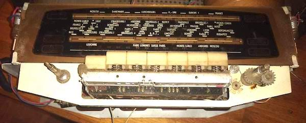
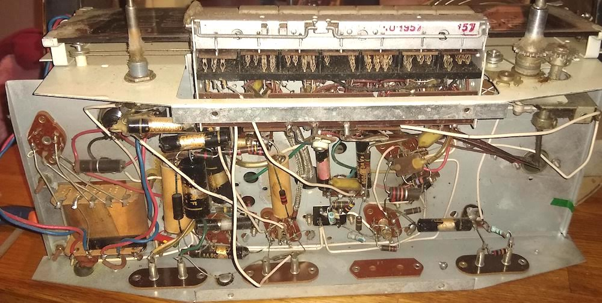
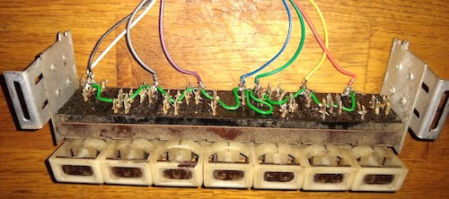
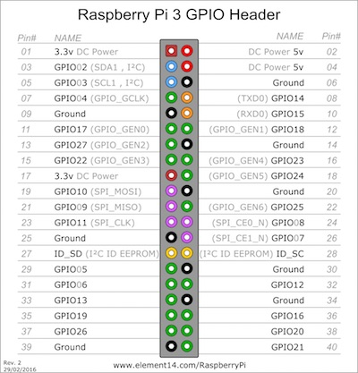
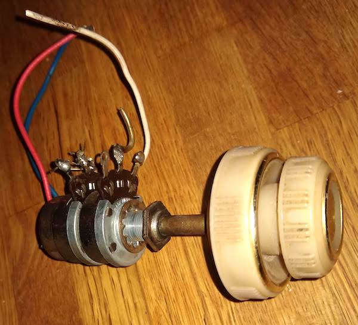

# Radio Vintage

Recyclage d'une vieille radio en pour en faire un objet beau et utile : Une station de streaming audio.

Dans ce projet, l'electronique d'époque n'est pas du tout exploitée : uniquement les boutons physiques et le haut-parleur d'origine qui sont directement branchés sur un [RaspberryPI "headless"](https://raspberry-pi.fr/raspberry-pi-sans-ecran-sans-clavier/) sur lequel tourne un serveur [mopidy](https://mopidy.com/) et une application JavaScript qui permet de changer de playlist en fonction du bouton enfoncé.

Pour améliorer la qualité du son d'origine vous pouvez ajouter un DAC (digital-analog converter) et/ou un ampli de chez [JustBoom](https://JustBoom.co) ou [HifiBerry](https://www.hifiberry.com/) par exemple.

Il est également possible de transformer facilement sa radio en Client Spotify connect avec [raspotify](https://github.com/dtcooper/raspotify) ou avec [PiMusicBox](https://www.pimusicbox.com/).

### Setup

#### Frontend



#### Backend



#### Montage avec la RaspberryPi

```
        |----(+5V)---- éclairage radio (origine)
        |
RaspberryPi----(gpio + gnd)---- 7 boutons       DAC
        |                                        |
        |----(audio)----|-----------|------------|-----> Speaker
                        |           |
                        |         Volume
                        |
                        |
                   Bouton On/Off
```

Il faut déconnecter, nettoyer et recabler chaque bouton ou potentiomètre que l'on veut exploiter.



Les boutons aurant une masse commune et l'autre pin sur un des ports GPIO du raspberry vont déclencher des "évènements" dans notre programme, lequel donnera des "ordres" au serveur mopidy qui gère la lecture du son.

Dans mon cas les 7 boutons sont branchés sur les GPIO : 17, 27, 22, 10, 9, 11, 5 et la masse commune sur un des Ground de la raspberryPI.



Pour l'audio, brancher la sortie du raspberry sur le Haut-Parleur. Le volume n'est pas assez fort/bon ? Ajouter un DAC et/ou un ampli au RaspberryPi.

Je n'ai pas encore réussi à exploiter le double potentiomètre d'origine pour pouvoir régler le volume 😭



#### Software

Le serveur [Mopidy](mopidy.com) propose de nombreux plugins, par exemple spotify, somafm, youtube... et une [API http+websocket très riche](https://docs.mopidy.com/en/latest/api/core) qui permet de contrôler la diffusion.

(Une autre possibilité est d'utiliser VLC qui propose lui aussi une API http (minimale) qui permet de gérer une playlist.)

La première étape est d'avoir le serveur mopidy fonctionnel.

Ensuite il faudra adjoindre un script JavaScript (ou Python) qui va pouvoir gérer les boutons de la radio.

Avec le module [onoff](https://github.com/fivdi/onoff) c'est assez simple :

```js
const Gpio = require("onoff").Gpio;

// déclare un bouton sur le GPIO 17
const button = new Gpio(17, "in", "falling", { debounceTimeout: 50 });

// déclenche un "callback" quand le bouton est enfoncé
button.watch((err, value) => {
  if (err) {
    throw err;
  }
  console.log(`Pushed button 1 (pin 17)`);
  playStream("http://icecast.radiofrance.fr/fipreggae-midfi.mp3");
});
```

La fonction `playStream` déclenche la lecture d'un stream/fichier sur mopidy, en appelant les API `core.tracklist.add` et `core.playback.play`.

On pourra utiliser [pm2](https://pm2.keymetrics.io/) pour lancer ce script automatiquement au démarrage du RaspberryPi.

Voir le script complet : [./index.js](./index.js)

## Tips

###### update.sh :

```sh
#!/bin/sh
scp index.js raspberry.local:/home/pi/radio-vintage/
```

### DAC justboom

Le [DAC Justboom](https://www.justboom.co/product/justboom-dac-hat/) occupe 100% du header de la raspberry mais il est possible de souder un autre header... se munir d'un header 40 pins à souder et d'un fer précis 😅 ([Merci Saint-Quentin radio](http://www.stquentin-radio.com/))

#### Johnny-Five + i2s

[johnny-five](http://johnny-five.io/) utilise [raspi-io](https://github.com/nebrius/raspi-io/issues/104) qui n'est apparemment pas compatible avec le DAC JustBoom 😢 (qui utilise i2s)

Workaround : utiliser un script Python ou [onoff](https://github.com/fivdi/onoff) en JavaScript.

### PiMusicBox

La distribution PiMusicBox est visiblement [peu active](https://github.com/pimusicbox/pimusicbox/graphs/contributors) et il est difficile d'installer des packages récents sur cette base. Il vaut mieux partir sur la [dernière Raspbian Lite](https://downloads.raspberrypi.org/raspbian_lite_latest) et [installer mopidy et ses plugins directement](https://docs.mopidy.com/en/latest/installation/).

### Potentiomètre

Le potentiomètre d'origine fait de 0 à 500k ohms ce qui est beaucoup trop pour pouvoir gérer analogiquement le volume;

Je n'ai pas encore trouvé de solution pour qu'il puisse gérer le volume...

### Development

Avec JavaScript, pour itérer rapidement en testant sur le rpi, vous pouvez utiliser `pm2 start script.js --watch` qui recharge le programme des que vous le modifiez.

Sur votre ordinateur de travail, créez un petit script pour envoyer les changements sur le rpi et la mise à jour sera directe.

## Ressources

 - [my rpi tips n tricks](https://gist.github.com/revolunet/f85a6fbe8b2688632c288f26010c9542)

